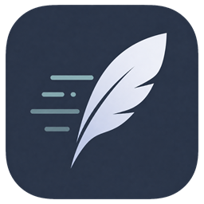

# FeatherCast

FeatherCast is a lightweight native Windows app launcher. A global shortcut opens a centered search overlay for installed apps and open windows, with real icons, fuzzy search, keyboard-first navigation, and a tray icon.



## Features

- App search across system and per-user Start Menu shortcuts plus AppsFolder entries
- Local installed-game discovery for Steam, Epic Games, GOG Galaxy, EA app,
  Ubisoft Connect, Battle.net, and Xbox/Microsoft Store without a FeatherCast login
- Dedicated Games browser, `@games` scope, provider labels, and local game artwork
- Open-window switching with foreground restore for minimized windows
- Open-window actions for screen halves, centering, and moving to the next display
- Token-aware fuzzy search ranked for launcher usage
- Search scopes: `@files`, `@apps`, `@games`, `@windows`, `@commands`, `@clipboard`, and `@snippets`
- Optional recursive live indexing for explicitly selected local folders
- Separately enabled local full-text search for supported text and source files
- On-demand text, image, and metadata preview pane
- Optional local clipboard history
- Calculator, unit/currency conversion, emoji, symbols, snippets, quicklinks, and web-search prefixes
- Native Library manager for creating, editing, and deleting snippets and quicklinks
- Local time, date, ISO-week, Unix-time, and UUID utilities
- Searchable Windows settings plus volume, media playback, and Show Desktop commands
- Searchable “Discover FeatherCast” guide with feature examples and shortcuts
- Native out-of-process plugin host with timeouts and crash isolation
- Lazy shell icon loading with a native PNG icon cache
- Keyboard-first controls: Up/Down, Enter, Ctrl+Shift+Enter, Esc
- Configurable global shortcut, default `Alt+Space`
- Compact mode, Windows accent sync, and custom accent color
- Manual and daily GitHub Release update checks with verified installers
- Background tray menu: Open FeatherCast, Settings, Quit

AI chat and AI provider settings were removed in the native remake.

## Usage

| Action | Key |
| --- | --- |
| Open / close overlay | `Alt+Space` by default |
| Move selection | `Up` / `Down` |
| Launch selected app or focus selected window | `Enter` |
| Launch selected app as administrator | `Ctrl+Shift+Enter` |
| Open result actions | `Tab`, `Right`, or `Ctrl+K` |
| Preview an indexed file | `Ctrl+Space` |
| Scroll an open preview | `Ctrl+PageUp` / `Ctrl+PageDown`, or the mouse wheel over it |
| Return from actions or a browse view | `Left` or `Esc` |
| Close overlay | `Esc` |
| Open Settings | Gear button or tray menu |
| Browse feature guide | Search for `help` or `Discover FeatherCast` |

Useful searches include `time`, `date`, `week number`, `unix timestamp`,
`generate uuid`, `display settings`, `volume up`, and `play or pause media`.
Open the action panel on a window result to arrange it, or on a text result to
copy or paste its value.

Type `@` to choose a search scope. A complete leading scope token limits the
query without changing normal root-search ranking. `@files` searches indexed
names and paths; when local content indexing is enabled, it also adds deduplicated
`Content match` results. An empty `@files` query shows recently modified files.
Press `Esc` once to remove an active scope, or `Ctrl+Space` on a file result to
open its preview.

The Games command opens a dedicated view of locally installed games. `@games`
searches the same library directly. Discovery reads only local launcher
manifests, registry entries, package registrations, and icon caches; it does not
sync owned libraries or store launcher credentials.

The tray icon runs in the background. Left-click opens search; right-click opens the menu.

## Development

Prerequisites on Windows:

- A current Visual Studio release with Desktop development with C++
- CMake 3.22 or newer
- Optional: NSIS if you want the CPack NSIS installer target

```powershell
cmake --preset windows-x64
cmake --build --preset release
ctest --preset release
cpack --config build-native/CPackConfig.cmake -C Release
```

The executable is produced as `build-native/Release/FeatherCast.exe` with Visual Studio generators.

Plugin authors should start with [docs/plugin-development.md](docs/plugin-development.md). Release and updater packaging notes are in [docs/releasing.md](docs/releasing.md).

## Settings and Cache

Roaming user configuration is stored under `%APPDATA%\FeatherCast`:

- `settings.json` stores launcher preferences, privacy choices, recent usage, appearance, and update state
- `snippets.json` stores user-authored snippets
- `theme.json` stores optional theme overrides
- `plugins/` contains user-installed native plugins

Machine-local operational data is stored under `%LOCALAPPDATA%\FeatherCast`:

- `feathercast.db` stores the optional file index and user-scoped DPAPI-protected clipboard history
- `icon-cache-native/` stores resolved PNG icons
- `updates/` stores verified update installers
- update and opt-in diagnostic logs

Clipboard history and file indexing are disabled until explicitly enabled in
Settings. File indexing is recursive, watches only selected fixed local drives,
and skips hidden, system, and reparse entries. It defaults to Desktop, Documents,
and Downloads when no custom roots are selected.

Full-text indexing has a separate Privacy opt-in. It reads supported text/source
files up to 2 MiB each and at most 256 MiB in total, then stores a local
contentless FTS token index—not original text or excerpts. Preview content is
read only on demand and is never persisted or logged. Image previews are limited
to BMP, GIF, ICO, JPEG, PNG, and TIFF, 25 MiB, and 40 megapixels. Settings provides
root management, index status, rebuild, disable, and delete controls.

This release intentionally does not index network drives, browser data, cloud
content, PDFs, Office documents, OCR output, or Shell preview handlers.

FeatherCast contacts GitHub Releases for enabled update checks and `open.er-api.com` for cached currency rates. Update installation is disabled in builds that do not contain an allowed Authenticode signer certificate pin. Plugins are native code running with the current user’s permissions and should only be installed from trusted sources.

Older AI-related fields are ignored and are not written back by the native app.

Snippets and quicklinks can be managed from **Settings > Library**. The JSON
files remain available as an expert and recovery path; FeatherCast refuses to
overwrite an invalid or externally changed `snippets.json` until it is reloaded.

## Icons

The application icon assets are kept in `build/`. Regenerate them with:

```powershell
powershell -ExecutionPolicy Bypass -File scripts/gen-icons.ps1
```

## Tech

FeatherCast is now a Win32 C++23 application rendered with Direct2D/DirectWrite. It uses native Windows APIs for tray integration, shell/app discovery, shortcut parsing, low-level keyboard hooks, window enumeration/focus, and shell icon extraction.

## License

This project is licensed under the MIT License - see the [LICENSE](LICENSE) file for details.
