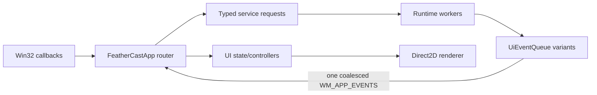

# FeatherCast Architecture

FeatherCast is a Windows-native C++23 launcher. The executable is split into a
Win32 composition root, a runtime library, and a UI library. Existing settings,
SQLite data, plugin ABI versions, paths, shortcuts, window identities, and
single-instance behavior remain compatibility boundaries.

## Ownership

`FeatherCastApp` owns HWND creation, the UI message loop, global shortcut and
tray registration, service lifetime, and routing. It is the only component that
may mutate live window state.

`FeatherCastRuntime` owns application models and background work:

- `PersistenceService` serializes settings and SQLite work and drains writes at
  orderly shutdown.
- `DiscoveryService` coalesces refreshes and suppresses stale generations.
- `SearchCoordinator` coalesces queries; `SnapshotCoordinator` prepares
  immutable corpus snapshots by revision.
- `LaunchService`, `IconResolver`, `CurrencyService`, and `UpdateService` own
  their workers and cancellation. WinHTTP implementation details live in the
  runtime network adapter.
- Command and setting descriptor catalogs provide stable IDs, labels,
  availability metadata, focus order, and confirmation policy.
- The capability catalog describes built-in feature discovery, examples, and
  typed guide actions without changing search-provider or plugin contracts.

`FeatherCastUi` owns UI-thread-only overlay/settings state and controllers. UI
state transitions and descriptor projections are pure and unit tested. Direct2D
resources are render-target-bound and must never be touched by runtime workers.
`FeatherCastApp` retains reference aliases for legacy rendering and routing code,
but the referenced values live exclusively in `OverlayState` and
`SettingsState`; new interaction state must be added to those production models.

## Thread Affinity and Event Flow

Workers receive value requests and return immutable payloads. They never call
the app or access mutable UI state. `UiEventQueue::Push` is thread-safe and posts
at most one outstanding notification. Only the UI thread calls `Drain` and
applies current-generation results. Events pushed after queue closure are
rejected.

## Shutdown

Shutdown is idempotent and ordered:

1. Mark the app as stopping so notifiers stop posting window messages.
2. Stop launch, discovery, search, snapshot, currency, update, extension, and
   icon workers; each service requests cancellation and joins its threads.
3. Drain serialized persistence work and close the database.
4. Close event queues so late producer results are rejected.
5. Release render resources, hooks, tray state, and windows on the UI thread.

No worker may outlive a service, and no service callback may target a destroyed
window.

## Persistence Compatibility

- `%APPDATA%\FeatherCast`: settings, snippets, themes, and user plugins.
- `%LOCALAPPDATA%\FeatherCast`: SQLite operational data, icon cache, updates,
  currency cache, and diagnostics.
- Settings JSON writes `"schemaVersion": 1`. A missing version is version 0.
  Files newer than the supported version are preserved and automatic saving is
  blocked.
- SQLite uses schema versioning, busy timeouts, integrity checks, and corrupt
  database quarantine. Clipboard text and previews remain protected with
  user-scoped Windows DPAPI.
- Native plugin ABI v1/v2 and plugin-host isolation remain unchanged.

## Change Rules

New services expose explicit start/stop and typed request methods. New ordinary
commands and settings belong in the descriptor catalogs. Platform operations
use narrow adapters or callbacks; no dependency-injection framework is needed.
Feature work must preserve external behavior unless a separate change explicitly
updates the compatibility contract.
